# AI Documents — user manual

AI Documents turns institutional files into published **information**. A policy
arrives as a PDF or a Word document, the plugin reads the text out of it,
structures it into headings, paragraphs, lists and tables, and publishes that as
a page of its own. The file itself is never linked, previewed or offered for
download — what the site publishes is the content, not the document it came in.

Everything on this page describes the plugin exactly as it ships. Extraction,
structuring and search all work with no API key at all; Google Gemini is an
opt-in layer on top for metadata suggestions, fixing a misread layout, and
semantic search.

## What this plugin does

Three things, in this order.

**1. It reads files.** Upload a PDF or a Word (`.docx`) file and the plugin
extracts its text and parses it into content blocks — three heading levels,
paragraphs, notes, nested lists and tables. This runs with regular expressions,
not AI: no API key, no request, no cost. Excel files are accepted for reference
but are not parsed.

**2. It splits compilations.** A single upload often holds fifty standalone
policies one after another. Tell the plugin the file is a compilation and each
policy inside becomes an entry of its own, with its own title, date, description
and content.

**3. It publishes and finds.** Each entry gets its own page at
`/documents/{entry}/`. A search shortcode puts a filterable catalogue on any
page, and — when Gemini is configured — answers a question typed in any language
with the one to three entries that address it, and a short explanation of why.

| | Works without an API key | Needs a Gemini key |
|---|---|---|
| Text extraction from PDF and Word | ✅ | |
| Structuring into headings, lists, tables | ✅ | |
| Reading title, teaser, date and history from labels | ✅ | |
| Splitting a compilation into one entry per policy | ✅ | |
| Keyword search and filters | ✅ | |
| Complete fields with AI | | ✅ |
| Restructure content with AI | | ✅ |
| Semantic search and the inline recommendation | | ✅ |
| Ask AI on a single entry | | ✅ |

## Requirements

- WordPress 6.0 or later
- PHP 8.0 or later
- A user who can `manage_options` (administrator) to change settings; editors can create and edit entries
- Optional, for the AI features only: a Google account with access to [Google AI Studio](https://aistudio.google.com/)

## Download and install
<!-- only:landing -->

The download button at the top of this page always carries the latest build. The
zip contains a single `ai-documents` folder, which is what WordPress expects.

1. Download the zip from the button at the top of this page.
2. In WordPress, go to **Plugins → Add New Plugin → Upload Plugin**.
3. Choose the zip, click **Install Now**, then **Activate Plugin**.
4. A **Documents** entry appears in the admin sidebar.
5. Open **Documents → Settings** and add a Gemini API key if you want the AI features. Everything else already works.

Installing over an existing copy replaces the plugin files. Entries, taxonomies
and settings live in the database and are left untouched.

> **Updating by hand instead.** Unzip the archive into
> `wp-content/plugins/`, replacing the existing `ai-documents` folder. Deactivating
> the plugin is not required, and no entry is lost either way.

## Connect Google Gemini

Every AI feature in the plugin — field suggestions, restructuring, semantic
search and Ask AI — goes through Google Gemini. One key covers all of them.

### Get a key

1. Open [aistudio.google.com/app/apikey](https://aistudio.google.com/app/apikey).
2. Sign in with a Google account.
3. Click **Create API key**.
4. Pick an existing Google Cloud project, or create one when prompted.
5. Copy the key — it starts with `AIza…`.

> Gemini's free tier covers normal institutional use comfortably. Current limits
> are at [ai.google.dev/pricing](https://ai.google.dev/pricing).

### Save it in the plugin

There are two places to enter the key and they write to the same setting, so use
whichever you happen to be looking at.

**Documents → Settings → AI** — paste the key, click **Test key** to check it
against the live API, pick a model, and click **Save Settings**.

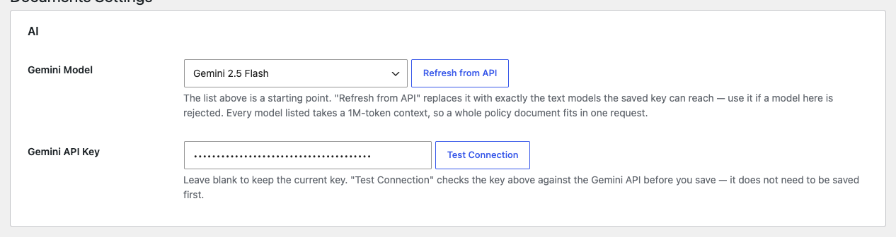

**Any document's editor**, in the *Complete fields with AI (optional)* panel —
paste the key, click **Check key & list models** to validate it and list what it
can reach, choose a model, click **Save**. This form only appears to
administrators. Anyone else editing a document without a key sees a note asking
them to get one from an administrator; extraction above it works either way.

### Choosing a model

The picker ships with the current Gemini line-up — 3.6, 3.5 and 3.1 Flash and
Pro, down to 2.5. **Refresh from API** (settings) or **Check key & list models**
(document editor) replaces that list with exactly what your key can reach.

Image, text-to-speech and other non-chat models are filtered out automatically:
Google's model-listing endpoint mixes every product line together, and nothing
but the id itself distinguishes them.

A Flash model is the right default. Pro costs more per request and the gain on
these tasks — reading labels, proposing a document type, re-typing block
structure — is small.

## Settings

**Documents → Settings** is a single screen in three parts. Entry URLs are
`/documents/{entry}/` and are not configurable.

### AI

The Gemini API key and the model, covered above. The key is stored as a
WordPress option; the field shows *Saved — leave blank to keep it* once set, so
re-saving other settings never clears it.

### Taxonomy

**Document Types** — what kind of document it is, one per line. Ships with
`Policies`, `Guidelines`, `Good Practices`, `Position Statements`. Saving
creates any term that does not exist yet. Removing a line from the list
takes the type out of the pickers and the admin menu, but does not delete
the term or unassign it from entries that already carry it. Every place a
Document Type can be set (the document editor, the multi-document import,
an AI proposal) reads this same configured list, and the AI is validated
against it — it never creates a type on its own.

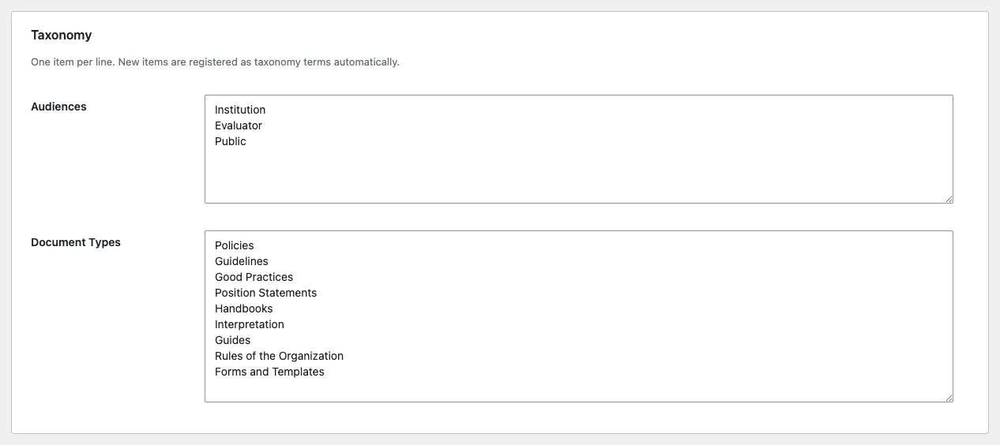

Each Document Type also becomes its own shortcut in the admin sidebar — see
[Find entries in the admin](#find-entries-in-the-admin).

### Shortcodes

A copy-to-clipboard reference of every shortcode and parameter, generated
against your own configured types. The full reference is in
[Shortcode reference](#shortcode-reference) below.

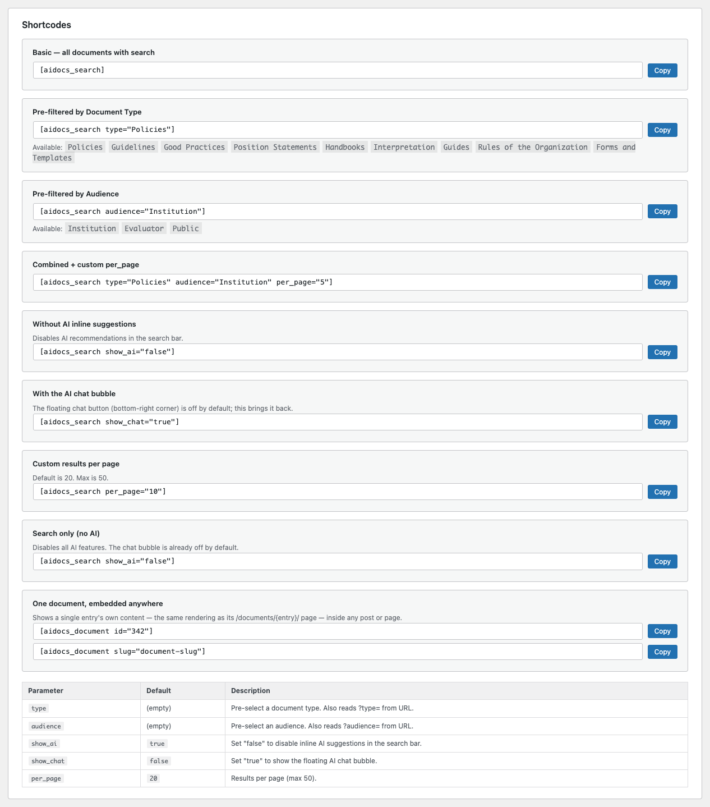

## Upload one document

This is the ordinary case: one file, one policy, one entry.

1. Go to **Documents → Add New Document**.
2. Leave **What are you uploading?** on **One policy**.
3. Click **Upload source file** and pick a PDF, Word (`.docx`) or Excel file through the media library.
4. Wait a moment. Extraction runs on its own, with no button to press.
5. Check the fields it filled in, correct anything that needs it, and click **Publish**.

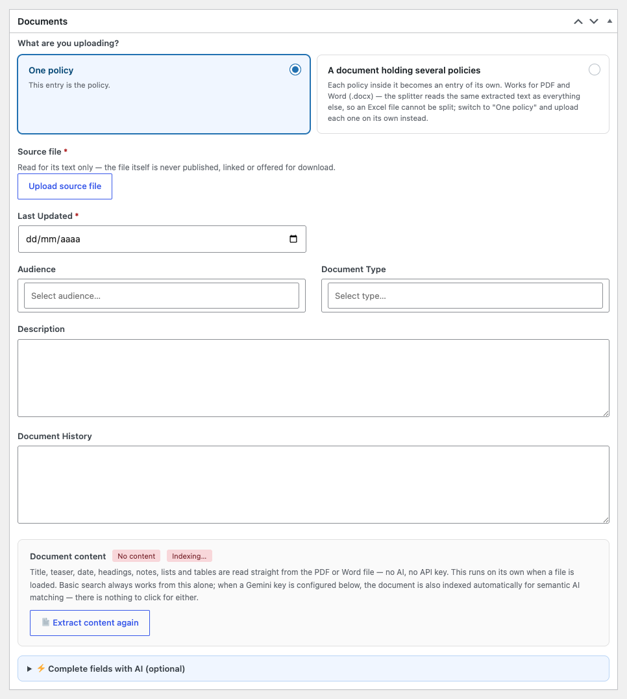

### What gets filled in automatically

When the source document uses the labelled schema — see [How to write a source
document](#how-to-write-a-source-document) — extraction is deterministic rather
than a guess, and fills several fields at once.

| Field | Where it comes from |
|---|---|
| **Title** | The document's own title line |
| **Description** | Its `Teaser:` label |
| **Last Updated** | Its `Last Updated:` label |
| **Document History** | Its `Document History:` label, shown at the foot of the published content |
| **Content** | Everything under `Body:`, parsed into blocks |

**Document Type** is never filled automatically. The label schema has no
section for it, so there is nothing deterministic to read it from — pick it
by hand, or have the AI propose it (see [Complete fields with
AI](#complete-fields-with-ai)).

> The description and the date are **never overwritten** once they hold a value.
> A manual correction always outranks the parser, including when you re-run
> extraction.

### Reviewing what was extracted

Under the file, the **Document content** panel reports how many blocks were
saved and whether the entry has been indexed for AI search.

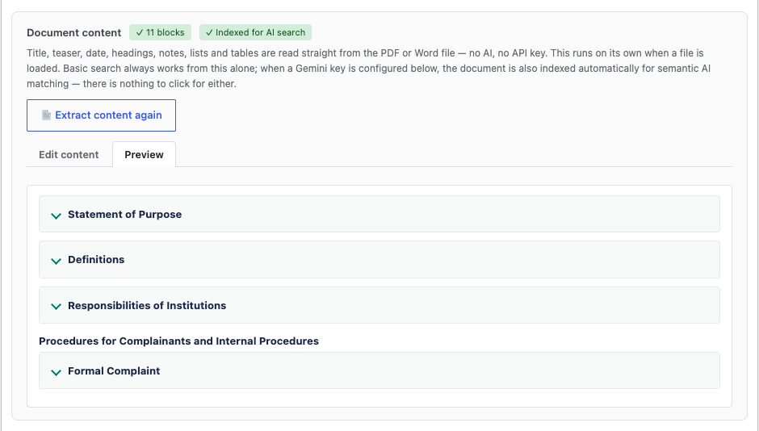

- **Edit content**, the tab it opens on, shows the plain text the parser read, editable before or after publishing.
- **Preview** renders the blocks exactly as a reader will see them.
- **Extract content again** re-runs the parser from the source file — use it after replacing the file.
- **Apply edited content** re-parses the text in the editor and writes the result, exactly as if it had been extracted from a file.

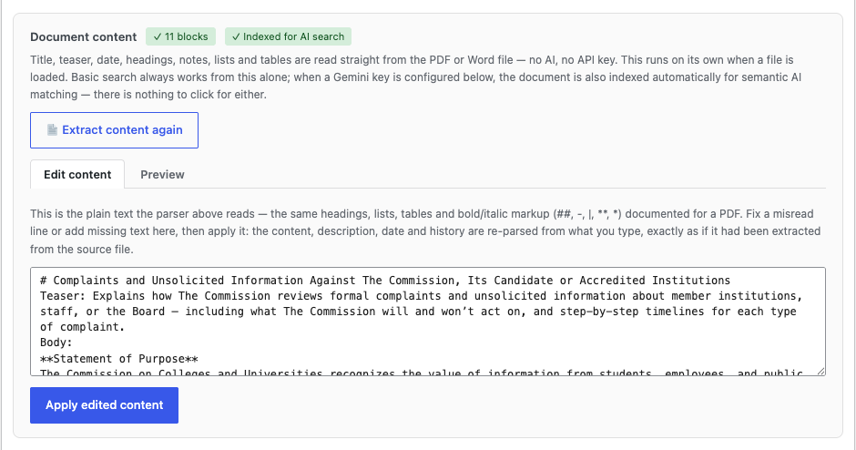

The text in **Edit content** is the same canonical format the parsers produce
from a PDF or a Word file: `##` for headings, `-` for list items, `|` for table
rows, `**bold**` and `*italic*`. Fixing a misread line here is usually faster
than fixing the source document and re-uploading it.

### The source file is never published

The file is read for its text and nothing else. It is not linked from the entry,
not previewed, not offered for download, and readers are never told which file
an entry came from. Replacing or removing the file after extraction does not
change the published content — the blocks are already stored on the entry.

## Upload a compilation of several policies

The files that arrive from a commission are usually one document carrying dozens
of standalone policies, and each of those has to become an entry of its own.

1. Go to **Documents → Add New Document**.
2. Set **What are you uploading?** to **A document holding several policies**.
3. Upload the PDF or Word file. The policies are found on their own — no AI, no API key.
4. Under **Complete fields with AI, per policy**, tick which fields the AI should fill for each policy. **Document Type** is ticked by default; Title and Description are usually read from the labels already, so leave them unticked unless this particular file is missing them.
5. Review **Policies in this document**. Each row shows the title, date, description and block count read from that policy. Untick anything that should not be imported.
6. In the **Publish** box in the sidebar, click **Create N entries** — the button counts what is still ticked.

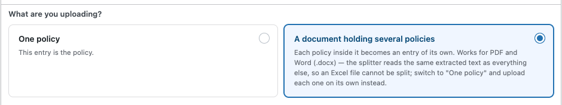

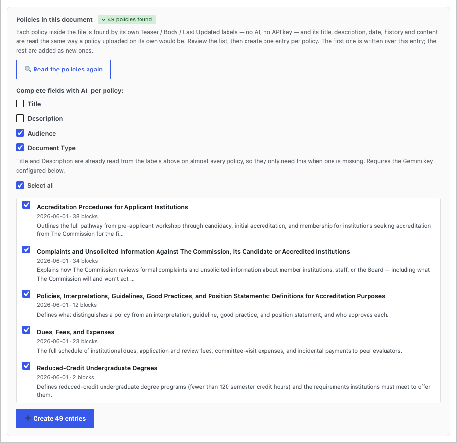

### What happens when you click Create

Every policy — including the one you started from — is created or updated as a
**published** entry. The import runs a few at a time — fewer when AI fields are
ticked, because each one is then an extra Gemini call alongside the embedding
every entry gets anyway.

There is no Save Draft or Publish/Update button in this mode: both are hidden,
and *Create N entries*, in its own **Publish** box in the sidebar, is this mode's
only save action. It writes straight to the database — published, not draft — as
each entry is made, so nothing is left half-saved when you leave the screen.

The imported entries carry **no source file**. The file held fifty policies and
none of them is it.

> Fields ticked under *Complete fields with AI, per policy* are written as soon
> as each entry is created — there is no per-policy review step. Reviewing
> forty-nine proposals one at a time is exactly what this batch flow exists to
> avoid. Everything remains editable on each entry afterwards.

### What can and cannot be split

**PDF and Word (`.docx`) both split**, because the splitter reads the same
extracted text either format produces. **Excel cannot** — it is not parsed at
all. Switch back to *One policy* and upload those one at a time.

What delimits a policy is the label schema: a policy carries exactly one `Body:`
label, so counting those counts the policies, and each one starts at the title
printed above its own `Teaser:` / `Body:` pair. A file without the labels cannot
be split. Anything before the first policy's title — a cover page, a table of
contents — is left out.

> Uploading a PDF that turns out to hold more than one policy switches the mode
> **automatically**. There is no need to notice that ahead of time and pick it by
> hand; the plugin says so on screen when it happens.

### Fields that disappear in this mode

Description, Last Updated, Document Type and the *Complete fields with
AI (optional)* panel are all hidden while the upload is a compilation. None of
them could hold one value that fits every policy in the file — which is precisely
why the per-policy checkboxes exist instead.

## Complete fields with AI

Below extraction, the collapsible **Complete fields with AI (optional)** panel
proposes values for the fields the label schema does not cover — in practice
Document Type — or offers a second opinion on the ones it does.

1. Open the panel and confirm it shows **✓ API key saved**.
2. Tick the fields to propose: Title, Description, Document Type.
3. Click **Propose with AI**.
4. Each proposal appears as its own card, next to the current value, editable before you accept it.
5. Click **Apply** on a card, **Apply all**, or **Discard** to drop a proposal.

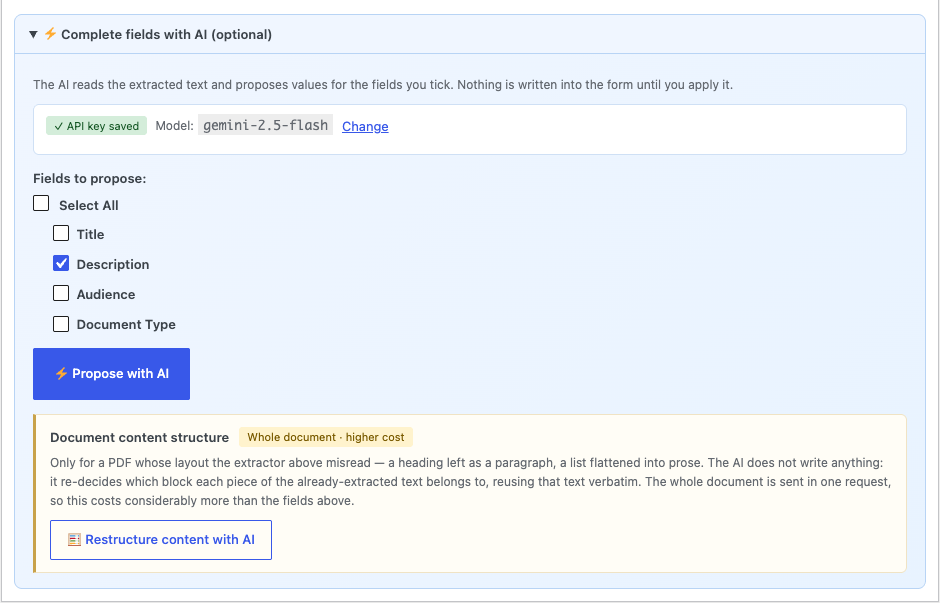

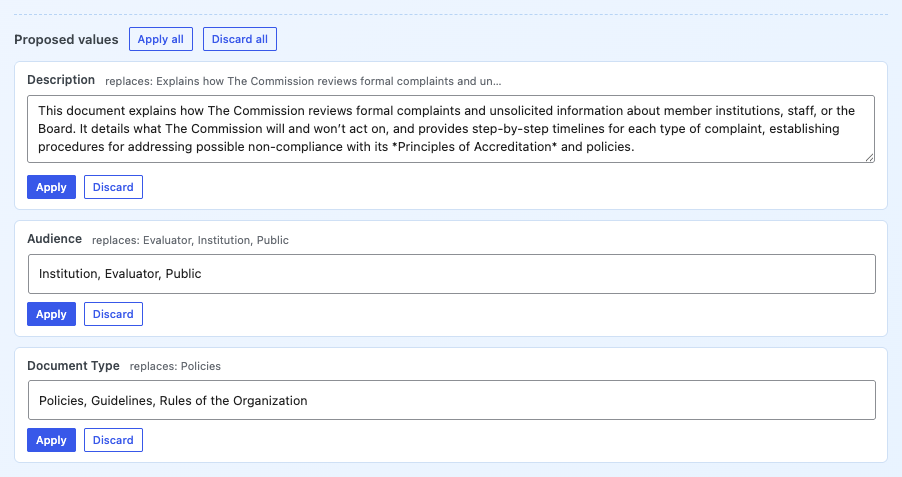

**Nothing is written into the form until you click Apply.** Applying only fills
the form field — the entry itself is saved when you click Publish or Update, as
usual.

The AI reads the extracted text, so it needs a file to have been extracted
first. On an entry with no content yet the panel says so rather than guessing.

## Restructure content with AI

A separate action in its own box, for a different problem: a PDF whose layout the
extractor misread — a heading left as a paragraph, a list flattened into prose.

The AI **does not write anything**. It re-decides which structural role each
piece of the already-extracted text has, reusing that text verbatim.

1. Click **Restructure content with AI**.
2. The result is compared word-for-word against the current content, and a fidelity report says what — if anything — was added or dropped. A clean run reads *Text is verbatim — every word matches the extracted content.*
3. Review the result under **Review the restructured content**.
4. Click **Replace content with this** to apply it, or **Discard** to keep the extracted version.

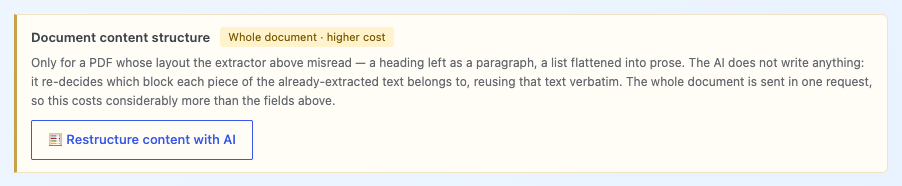

> This sends the **entire** document in one request, so it costs measurably more
> than the field proposals above. Use it when the structure is wrong, not as a
> routine step. The panel is flagged *Whole document · higher cost* for that
> reason.

Nothing is written to the entry until you choose to apply it.

## Edit a published entry

Once an entry has content, its editor looks different from the Add New screen.
The upload-mode question, the source-file card and the compilation panel are all
gone — they only ever applied while the entry was being set up.

What is left is everything editable directly: Title, Last Updated,
Document Type, Description, Document History, and the content itself through the
same **Document content** panel described above.

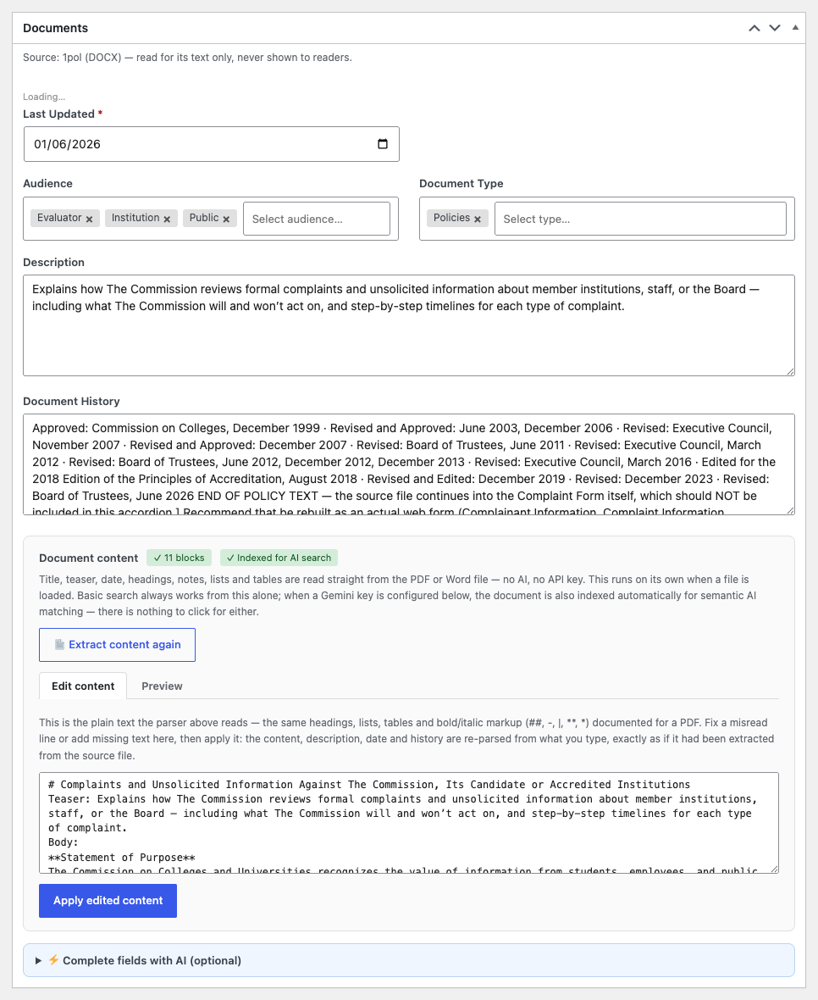

To change the content of a published entry, use **Edit content** → **Apply
edited content**. To rebuild it from a corrected source file, replace the file
and use **Extract content again**.

## Find entries in the admin

**Documents** in the sidebar lists All Documents and Add New, then one shortcut
per configured Document Type under a **Browse by Type** heading, then Settings
and Documentation. Each type shortcut opens the ordinary Documents list,
pre-filtered to that type.

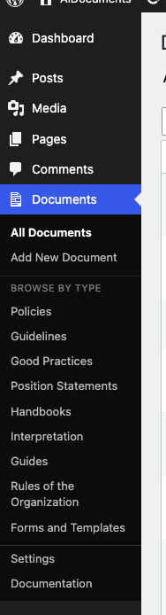

The list itself also carries a **Type** dropdown next to the Published/Draft/Trash
tabs and the search box. It is an independent filter, not a replacement for
those: picking a type narrows whichever status tab or search is already active,
the same way WordPress's own date filter does.

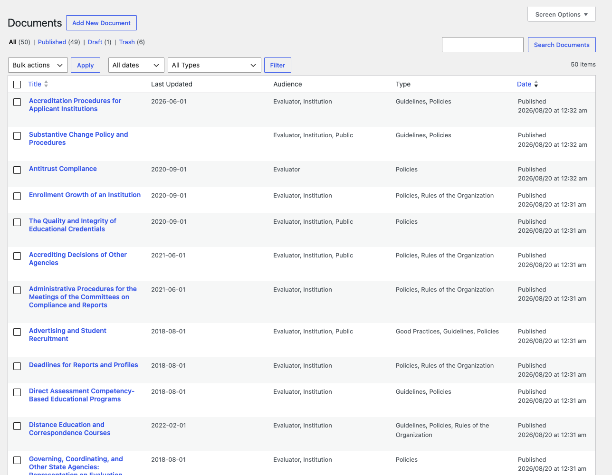

## What readers see

### The entry page

Every entry has its own URL, `/documents/{entry}/`, rendered inside your theme's
header and footer:

- a type tag, and the description
- a metadata grid
- a table of contents, when the content has more than one section
- the content itself, as collapsible sections
- the revision history
- an **Ask AI** bar pinned to the bottom, when a Gemini key is configured, for questions about that one entry

There is no download button and no file preview. The source file is not part of
what a reader is offered.

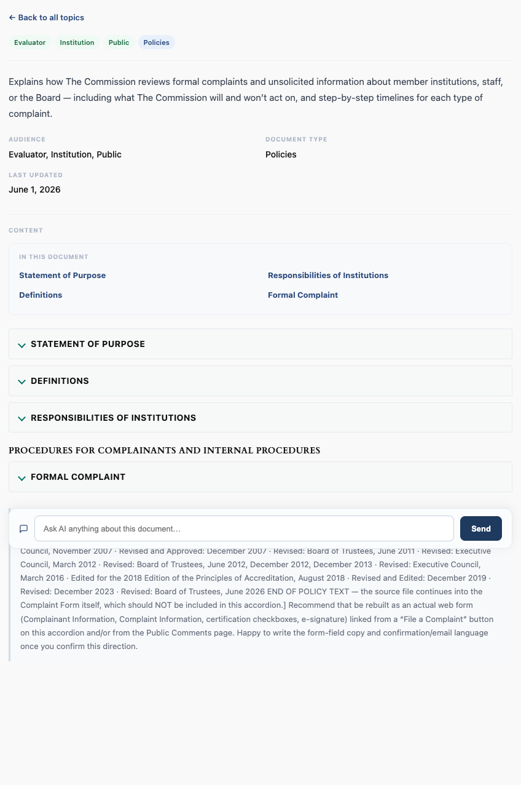

### The search page

The catalogue lives wherever you place the `[aidocs_search]` shortcode.

- **Keyword field** — type in any language. After roughly 600 ms of no typing, and only with a Gemini key configured, the AI answers in that same language and surfaces the one to three entries that address the question, each with a **View details** button. Without a key, the field still runs a plain WordPress keyword search.
- A **Document Type** tab bar narrows the results.
- **×** clears the field and reloads the full catalogue.
- **Search** runs a keyword search and shows the full results list.
- Pagination, 20 results per page by default.

Every result card links straight to that entry's own page. No card carries a
format tag or a download link.

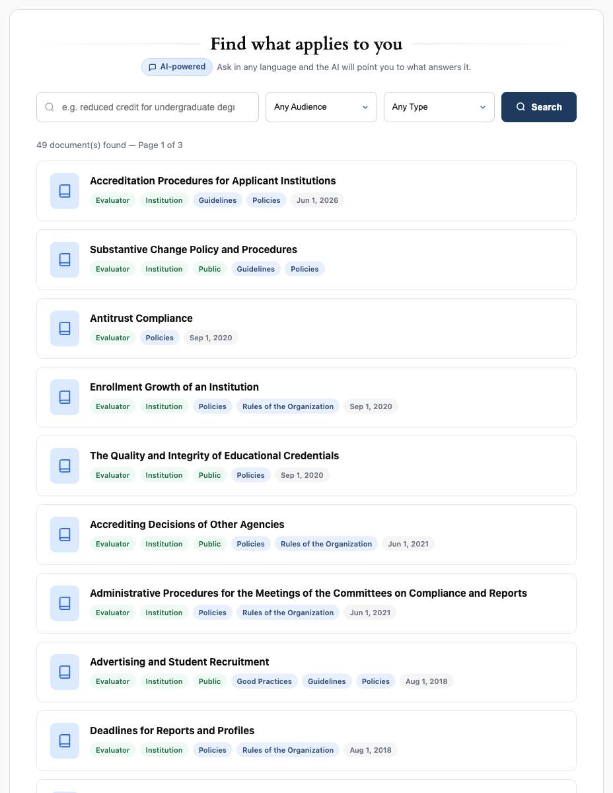

Ask it a question rather than a keyword and the recommendation appears above the
results, in the language the question was asked in.

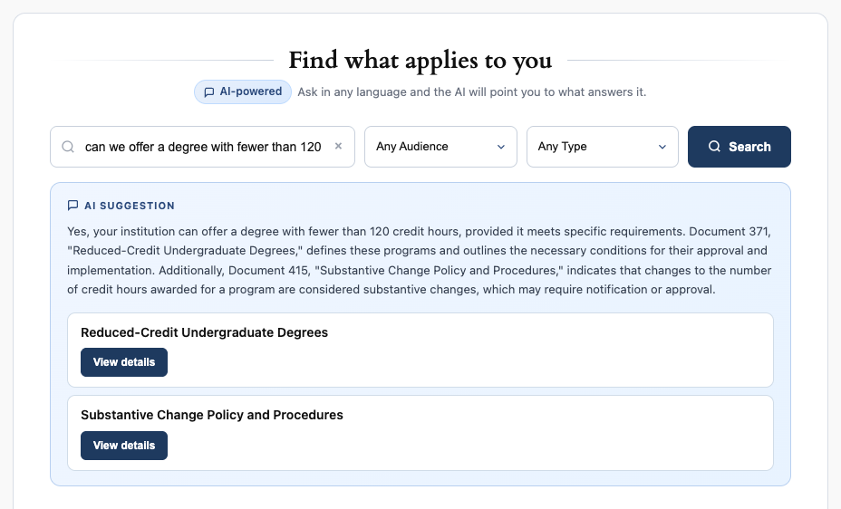

> The explanation currently names each entry by its internal post ID
> ("Document 371") as well as by title. It is cosmetic — the cards below it are
> what readers click — but it is a known rough edge, not something configured
> wrongly on your side.

## Shortcode reference

Two shortcodes. `[aidocs_search]` places the catalogue; `[aidocs_document]`
embeds one entry's content.

### `[aidocs_search]` — the catalogue

```
[aidocs_search]
```

Renders the keyword field, both filter dropdowns, the result list and its
pagination. `/{archive}/` already shows this same search, so the shortcode is
what to use for putting it somewhere else as well — a second page with different
pre-selected filters, for instance.

| Parameter | Default | Accepts | What it does |
|---|---|---|---|
| `type` | *(empty)* | A Document Type name | Pre-selects that type in the filter. Matched case-insensitively against the configured types; an unknown value is ignored rather than showing nothing. |
| `per_page` | `20` | `1`–`50` | Results per page. Values outside the range are clamped, not rejected. |
| `show_ai` | `true` | `true` / `false` | `false` turns off the inline AI recommendation in the keyword field. Keyword search and filters still work. |
| `show_chat` | `false` | `true` / `false` | `true` brings back the floating AI chat bubble. Off by default: every result card already links to its entry, so the bubble duplicates that with a second way to get there. |

#### Reading filters from the URL

`type` is also read from the query string, and the URL wins over the
attribute. So a single page carrying a plain `[aidocs_search]` can be linked
as a pre-filtered view:

```
/policies/?type=Guidelines
```

That is what makes one search page enough for every "show me only X" link in a
menu or a sidebar.

#### Recipes

A no-AI page, ten at a time:

```
[aidocs_search show_ai="false" per_page="10"]
```

Policies only, with the chat bubble on:

```
[aidocs_search type="Policies" show_chat="true"]
```

A compact embed inside a wider page:

```
[aidocs_search per_page="5"]
```

### `[aidocs_document]` — one entry, embedded

```
[aidocs_document id="123"]
[aidocs_document slug="academic-integrity-policy"]
```

Renders one entry's own content — the same rendering as its `/documents/{entry}/`
page, minus the "Back to all topics" link — inside any post or page.

| Parameter | Default | Accepts | What it does |
|---|---|---|---|
| `id` | *(empty)* | A post ID | The entry to embed. Take it from the `post=` value in the editor's URL. |
| `slug` | *(empty)* | A URL slug | The entry to embed, by slug. Ignored when `id` is given. |

Pass one or the other. If neither resolves to a **published** entry of type
`aidoc`, administrators and editors see a short note saying so and visitors see
nothing at all — a draft or a deleted entry never leaves a broken block on a
live page.

> Both shortcodes work in the block editor's Shortcode block, in a Classic
> editor, in a widget, and anywhere `do_shortcode()` is called from a theme
> template.

> **Copy it straight from the entry.** Once a document is published and has
> content, its own edit screen shows a **Shortcode** box in the sidebar with
> `[aidocs_document id="…"]` already filled in and a **Copy** button — no need
> to look up the ID by hand. The box appears only once there is something to
> embed: a draft, or an entry still mid-setup, shows no shortcode yet.

### Using them in the block editor

1. Add a **Shortcode** block where the catalogue or the entry should appear.
2. Paste the shortcode, including its square brackets.
3. Update the page, then view it — shortcodes render on the front end, not in the editor canvas.

The copy buttons in **Documents → Settings → Shortcodes** produce these same
snippets, already filled in with your own configured types and a real entry ID
from your site.

## How to write a source document

Extraction always produces *something*. It produces the **right** thing, without
a single guess, when the source document carries these labels.

```
<Document title>
Teaser: <one-paragraph summary>
Body:
<the content: paragraphs, headings, bulleted requirements, tables>
Last Updated: <Month YYYY> (<body that approved it>)
Document History: <provenance line>
```

Each marker is accepted written four ways, so an existing house style rarely has
to change:

- `Label:` followed by the content
- `[Label]` followed by the content
- `[Label] content` on one line
- a line holding nothing but the label

### For a compilation

Put one labelled policy after another in the same file. A policy is delimited by
its own `Body:` label, and starts at the title line printed above its
`Teaser:` / `Body:` pair. Cover pages and tables of contents before the first
policy title are ignored.

### How reliable this is

Validated against the 50 documents of the master compilation: **50 of 50**
recover a title and a body, **48 of 50** a teaser and a date. The two that do not
are fragments of a larger document and carry neither label.

### Without the labels

A file with no labels still extracts. A PDF is read through its own layout —
bold weight, point size, left margin, line spacing — and a Word file through the
styles already recorded in the `.docx`. Both produce the same canonical text,
which the same parser then turns into blocks, so nothing downstream cares which
kind of file it came from.

That path is a heuristic, not a guarantee. Expect to correct a heading or two in
**Edit content**, or to use [Restructure content with
AI](#restructure-content-with-ai) when the layout was misread wholesale. And a
file without labels cannot be split into several policies at all.

## Troubleshooting

**Nothing was extracted from the PDF.** The file is probably a scan — an image of
text, with no text layer. Run it through OCR first, or paste the text into **Edit
content** and click **Apply edited content**.

**The AI panel says no text was extracted.** Extraction has not run or produced
nothing. Load a file and wait for the block count to appear before using any AI
action; the AI reads the extracted text, not the file.

**The key was saved but nothing AI-related works.** Open **Documents → Settings →
AI** and click **Test key**. A failure there is a key or quota problem at Google,
not a plugin problem. If it passes, click **Refresh from API** and re-pick the
model: a model saved earlier may no longer be one your key can reach.

**A compilation reports one policy, or none.** The file does not carry the label
schema, so there is nothing to split on. Check that each policy has its own
`Body:` label. Otherwise upload the policies one at a time.

**Headings came out as paragraphs.** Fix them in **Edit content** with `##`
markers, or use **Restructure content with AI** if there are too many to fix by
hand.

**An entry shows *Indexing…* and never changes.** The embedding call needs a
working Gemini key. Without one, the entry is still published and still findable
by keyword — only semantic matching is unavailable.

**A type shortcut vanished from the sidebar.** Its line was removed from
**Settings → Taxonomy**. Adding the line back restores the shortcut; the term and
its entries were never touched.

## Keeping this documentation up to date

This page, the plugin's own **Documents → Documentation** screen and the repository
manual are one source and three outputs.

```
docs/DOCUMENTATION.md          ← edit this
        │
        ├─▶ docs/index.html                  the page you are reading
        ├─▶ docs/generated/admin-page.html   Documents → Documentation
        └─▶ docs/downloads/*.zip             the download button
```

To publish a change:

```bash
bash tools/build-docs.sh
```

That reads the version straight out of the plugin header, deletes the previous
zip, compresses the current source into a new one, and regenerates both pages
around it. Nothing carries a hand-typed version number, so nothing can disagree
with the plugin it documents.

Screenshots live in `docs/assets/screenshots/`. Replacing one file updates it
everywhere it appears, in all three outputs, with no other edit.

To publish the landing page, upload the `docs/` folder to any static host — it
is plain HTML, CSS and JavaScript with no build step and no dependencies.

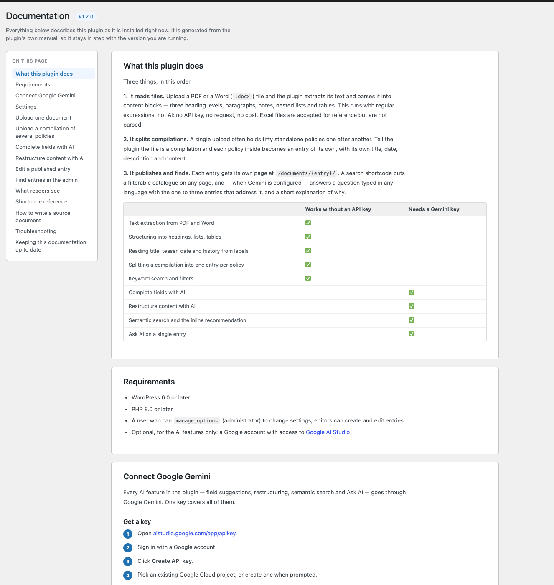
